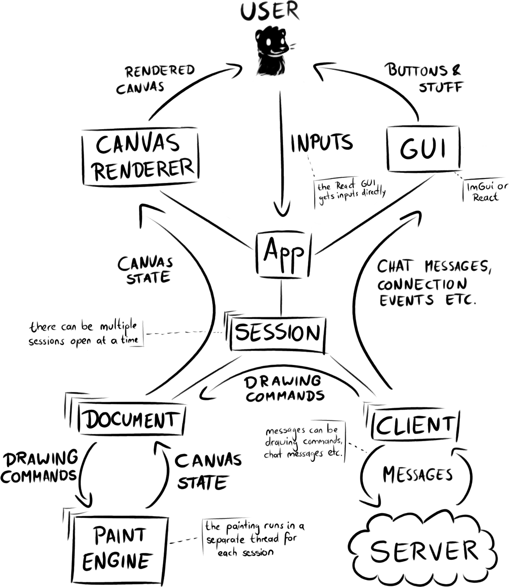
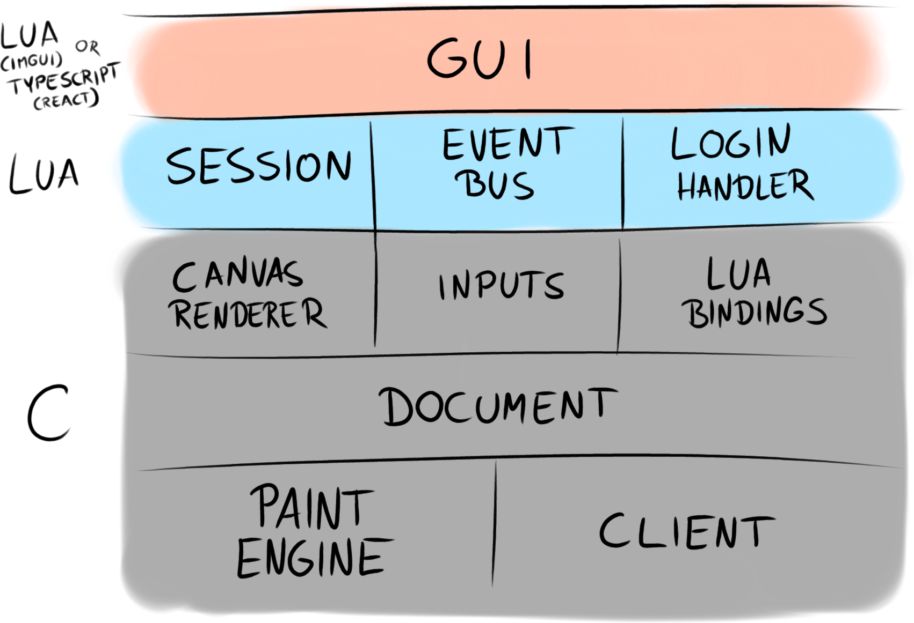

# Application Overview

Drawdance as an application comes in multiple flavors. At the time of writing, those are a Linux desktop application and a browser application. They differ in their user interface: the desktop version uses Dear ImGui, the browser one uses React. In the browser, the main application runs as an Emscripten WebAssembly application, on desktop it's just a native app.

## Usage Overview

Here's a somewhat simplified look at how the application itself is generally structured.

At the front end of things, there's the *user*. They are actually seeing two different things being presented to them: the *rendered canvas* and the graphical user interface (*GUI*) on top of it. The canvas is the same on all versions of the application, it's rendered directly using OpenGL ES 2.0. The GUI is platform-specific, on desktop it's Dear ImGui drawing its user interface elements on top of the rendered canvas, in the browser it's a React frontend that puts its HTML elements around a canvas element that, fittingly, holds the drawing canvas.

The user's *inputs* go either to the canvas (panning, zooming, rotating) or to the GUI (click a button, type stuff in an input field). In the case of the browser, the inputs that aren't meant for the canvas actually never reach the core application, they're swallowed by the React interface instead.

In the *application*, there may be zero or more *sessions*. Multiple sessions are supported, but at the time of writing the browser GUI artificially limits this to a single session at a time to keep the interface simple. The desktop client presents multiple sessions in different tabs.

Each session has a *client*, which communicates to the server via TCP sockets on desktop (connecting to a Drawpile server directly) and WebSockets in the browser (connecting to Drawdance's WebSocket proxy server, which is probably also what's serving the GUI in the first place.) The client sends and receives *messages*, which may be drawing commands, chat messages or whatever else the client and server want to talk about.

Every connected session also has a *document*, which holds the undo history and current state of the canvas. It is fed by drawing commands coming from the client, which it sends to the *paint engine* to actually do the drawing and update the canvas state. On every frame being rendered, the current canvas state is grabbed by the canvas renderer and presented to the user. Switching between different running session simply means that the renderer will grab the canvas state from a different document on the next frame.

Drawdance uses separate threads for the paint engine, the client and the application. Every session gets its own threads for painting and networking. Since multithreading is really hard, the threads don't communicate with each other in a synchronous way. Messages are buffered in queues. The document, paint engine and canvas state don't interact with the canvas renderer beyond providing it with the current canvas, they don't hold information on what changed since last time the canvas was rendered.

A document could actually be connected to other things than a network client, for example it could read a session recording and produce the canvas state from that. At the time of writing, that's not implemented though.

## Layers View

Another way that may be useful to look at the application is as a set of layers. This view is simplified again, there's actually even lower-level stuff like messages, queues and threading, but that's implementation background noise.

At the lowest level, on the backend, there's the paint engine and the client. They are tied together through the document, taking messages from the client and making the paint engine produce a canvas state from them.

Above that is the canvas renderer, which draws the canvas via OpenGL, the inputs component, which translates raw SDL input events into something usable, and bindings for Lua scripting.

The fluffier parts of the application are actually handled in Lua. Sessions are held and handled there. There's an event bus that deals with routing user interactions and connection events. The login handler takes care of the handshake procedures when a user connects to a server, dealing with usernames, passwords, et cetera.

On top of all that, there's the GUI. It (should) only communicate to the rest of the application via events. In the case of the desktop application, that's actually not quite the case, there's still some code that rummages around in application state directly. The browser frontend however has no choice but to communicate via events, since it doesn't have direct access to the Lua or C data structures.

Since it may be surprising: yes, Lua is running in the browser too. The Lua interpreter is also just a C library and gets compiled to WebAssembly just fine. You don't really see any of that from the React frontend's perspective though, it just sees a canvas element and exchanges events.

The reasoning behind this architecture is to write the performance-sensitive stuff (painting, networking, rendering) in C because it's fast and runs everywhere. The things that don't need to run that fast are scripted in Lua, allowing for faster iteration during development, while still working the same on every platform. The GUI is the most variable element of all, so it gets its own layer and is written separately for each platform.

The result is a *portable* application, in the sense of *being able to port it* and making it run well on each platform, not in the sense of writing it once and having somethign mediocre on different platforms. The most platform-specific part - the GUI - has the least logic of all, only having to send and receive events. On the lower layers, there's few pieces that need platform specificity: the innards of the client, the threading implementation and the dispatch of Lua events to the browser are the few relevant cases.
